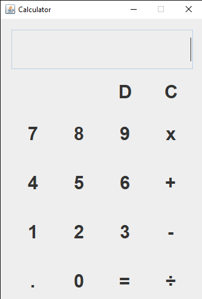

# Swing Calculator Application

A Simple java calculator application using java **Swing**, GUI toolkit for java. Allowing users perform basic arithmetic calculations such as addition, subtraction, division, multiplication

- Author: Ambali Oladele Ridwan
- Matriculation no: U23CS1019
- Department: Computer Science
- Github acc: [@IamRed-One](https://github.com/iamRed-One)
- Calculator repo: [Swing Calculator](https://github.com/iamRed-One/Swing-Calculator-U23CS1019)

## Screenshot

